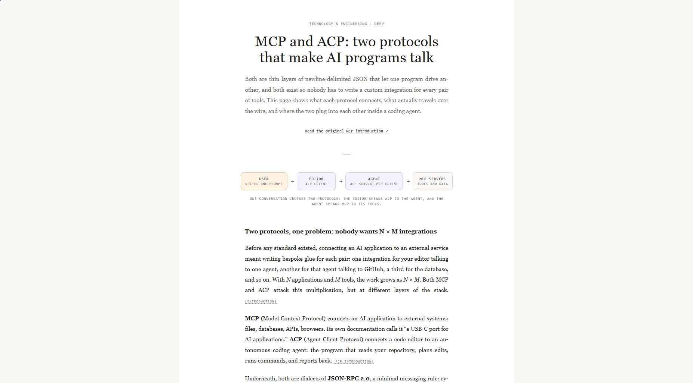
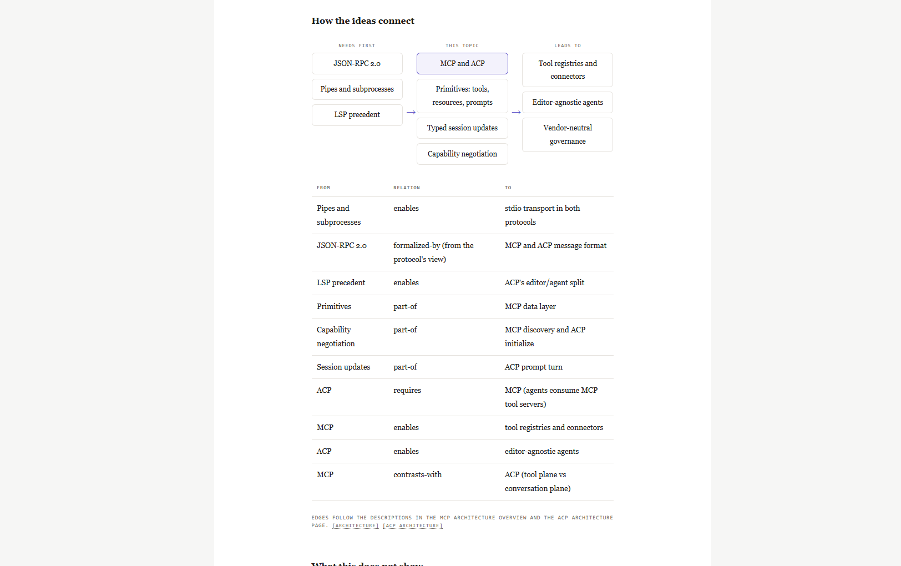
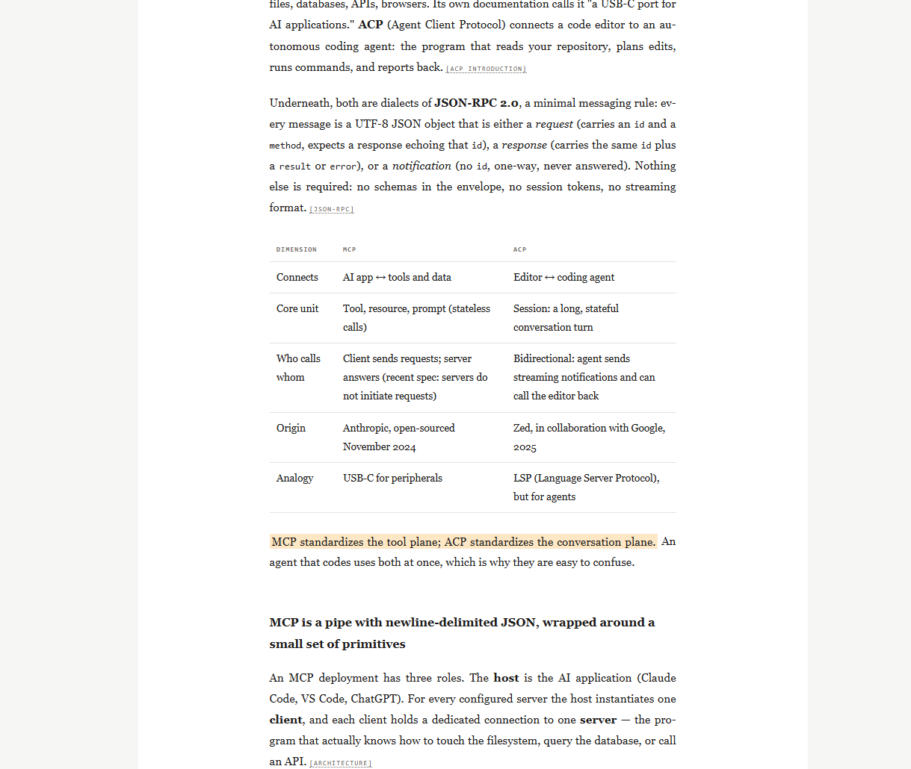

# Philosopher (OKF)

One folder that teaches any model how to explain **any topic** as a single, white, research-paper-style HTML page: centered column, serif text, tiny monospace labels, amber highlights on the sentences worth remembering, CSS-drawn diagrams, a concept map, and a references list where every entry says what it supports.

The knowledge lives in an [Open Knowledge Format](https://okf.md/spec/) (OKF) bundle: plain Markdown with YAML frontmatter, no SDK, any model can read it.





## Layout

```
philosopher-okf/
├── SKILL.md                  # entry point for skill-aware agents (Claude, Codex, Cursor)
├── okf/                      # the OKF bundle
│   ├── index.md              # root index (declares okf_version 0.2)
│   ├── log.md                # change history
│   ├── core/                 # workflow, classifier, contract, template, sources, depth, graph
│   └── domains/              # 12 study domains, one file each
├── scripts/validate.sh       # OKF conformance + link check
└── examples/
    └── sample-flamingo-reading-guide.html   # what the output looks like
```

## Domains

Technology and engineering · Medical and health · Natural sciences · Mathematics, statistics and logic · Finance and accounting · Economics · Business and management · Law and policy · Humanities, philosophy and history · Social sciences and psychology · Research papers · General

## How a model uses it

1. Reads `okf/core/workflow.md` (the 8-step procedure, lazy load table, token budget).
2. Classifies the question (`core/classifier.md`) into one primary domain.
3. Loads only what the depth needs: **brief** = template + the domain's `# Quick card` (~3 reads), **standard** adds source policy and depth policy, **deep** adds the graph method and the full domain file. Research is capped per depth (brief 2 searches / 0 fetches, standard 4 / 2, deep 8 / 4), and fetched pages are noted, not re-read.
4. Writes `<topic>.html` in one call. The user opens it in a browser.

## Use it

| Tool | How |
|---|---|
| Claude (skills), Claude Code | Put this folder where your skills live; `SKILL.md` is the entry. |
| Cursor, Codex, other coding agents | Add to `AGENTS.md`: "For explanations, follow `philosopher-okf/SKILL.md`." |
| ChatGPT, Gemini, any chat model | Upload the zip, or paste `SKILL.md`, `core/workflow.md`, `core/page-template.md` and one domain file. |
| MCP | Serve `okf/` as resources; any server that exposes files works. |

Ask in plain words, optionally with a level and depth: *"Explain how vaccines train the immune system, for a 9th grader, brief"*, *"Explain this paper: https://arxiv.org/abs/2204.14198"*.

## Validate

```bash
bash scripts/validate.sh okf
```

Checks the three OKF rules (frontmatter, non-empty `type`, reserved files), that `index.md` has no frontmatter except the root's `okf_version`, that `log.md` uses ISO dates, and warns about broken links.

## Extend

1. Add `okf/domains/<slug>.md` with `type: Study Domain` (copy any existing domain).
2. Add a row to the routing table in `okf/core/classifier.md`.
3. Add an entry in `okf/index.md` and `okf/domains/index.md`.
4. Add a dated line to `okf/log.md`, then run the validator.

## Classifier hook

`core/classifier.md` routes by keywords and intent. If your pipeline has its own classifier, pass its label as one of the domain slugs and the skill uses it directly (rule 1 in the classifier file).

## Known limits

* **Token targets per run** (whole context, including research and the written page): **brief under 12k, standard under 25k, deep under 45k**. The levers are the workflow's research caps, the lazy load table, domain Quick cards, and writing the HTML in a single call. A run that skips fetched pages in favour of notes will land well under these numbers; a run that pulls several full documents will not.
* Source lists point to host-level addresses of well-established sites. They were not link-checked from the build environment, so run a link checker in CI before publishing.
* The sample page was built from the paper's public abstract record and the section list, and is marked as such. Check figures against the full text.
* Models without web access can only cite from memory. The source policy makes them say so on the page instead of inventing links.

## License

MIT. See `LICENSE`.
